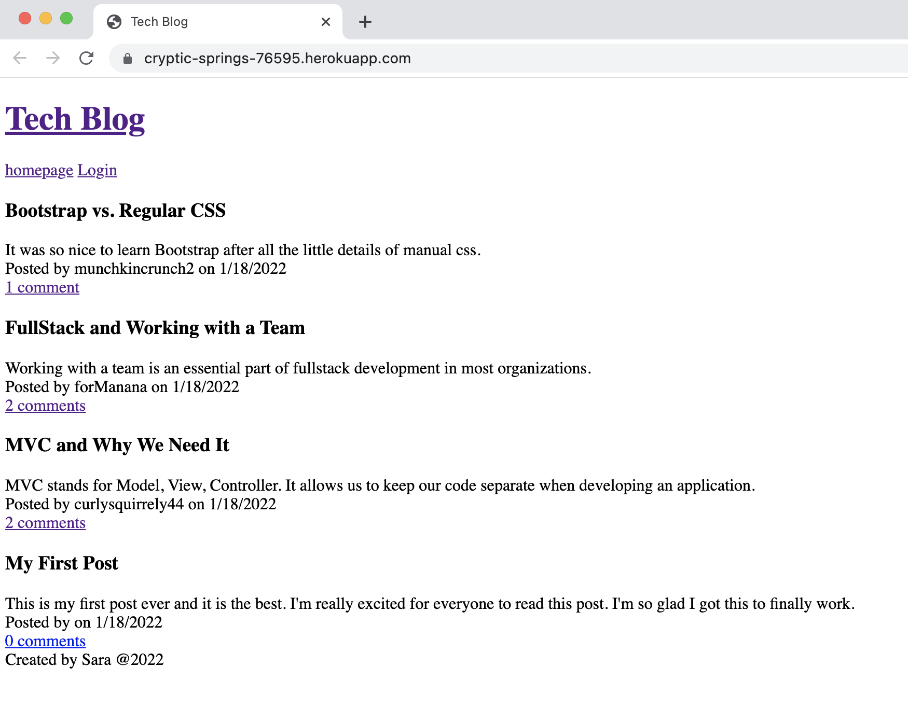

# Tech Blog

## Description

This application is created to provide a CMS-style blog site so that a developer who writes about tech can publish articles, blog posts, and their thoughts and opinions.

## Software

This application was created using JavaScript, Node.js, Express, MySQL, MySQL2, Sequelize, Express, Express-handlebars, BCrypt, and more with Visual Studio Code, as well as Insomnia.

## Application

The user can visit the site for the first time and are presented with the homepage, which includes existing blog posts that have been posted. There are navigation links for the homepage and an option to log in. When the user clicks on the homepage option, they are taken to the homepage. When they click on log in, they are taken to another page where they can log in or select to sign up. If they choose to sign up, they will create a username, and enter their email and a password. After they click the button, they are taken to their dashboard. The user credentials are saved. On their dashboard, they see their posts, which they can edit or delete. They can also create a new post. Once they create a new blog post, the post is added to their "My Posts" section, and also on the homepage. Users that are logged in can comment on other posts, as well. When they are done using the application, they can log out of the application via the navigation bar. 

## Webpage

The following image shows a screenshot of the application: 

You can access the GitHub repository here: https://github.com/fssaberi/tech-blog.git. 

You can access the webpage here: https://cryptic-springs-76595.herokuapp.com/. 